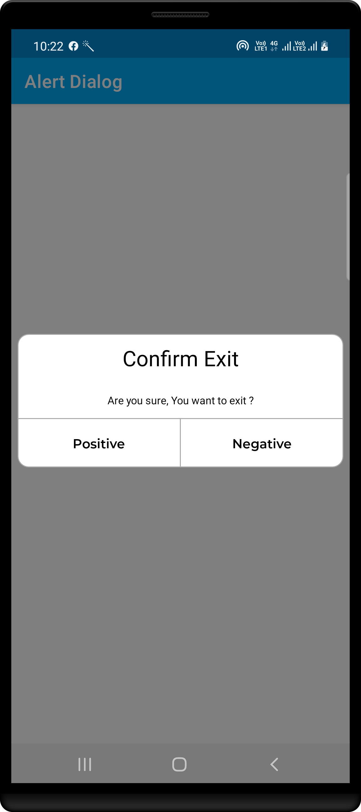
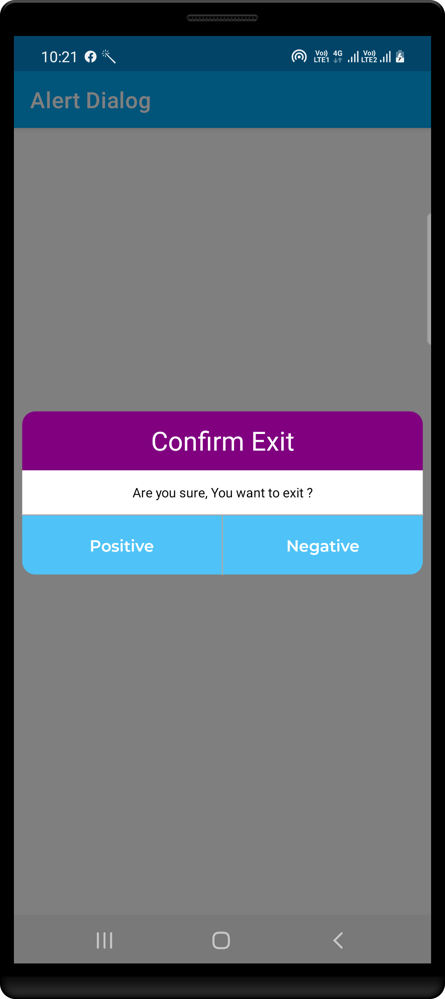
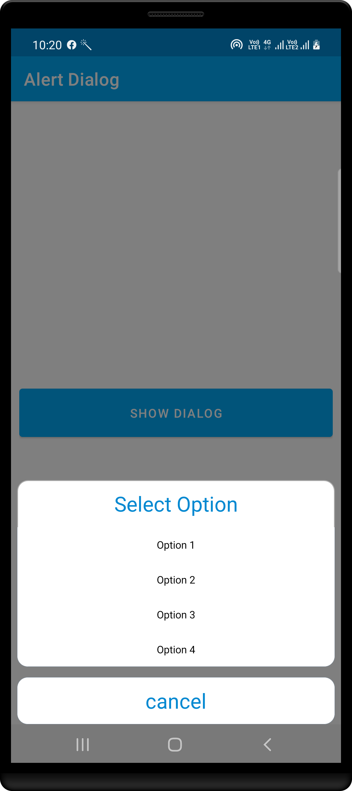
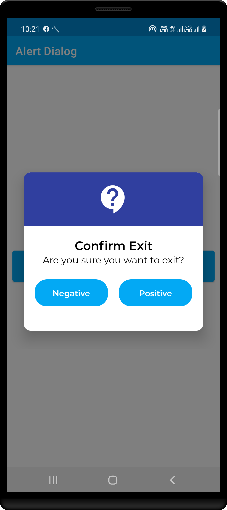
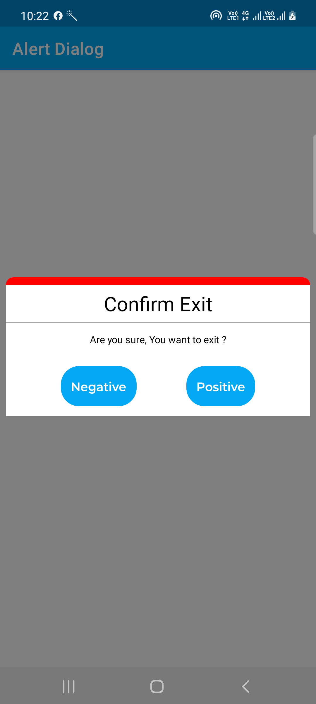
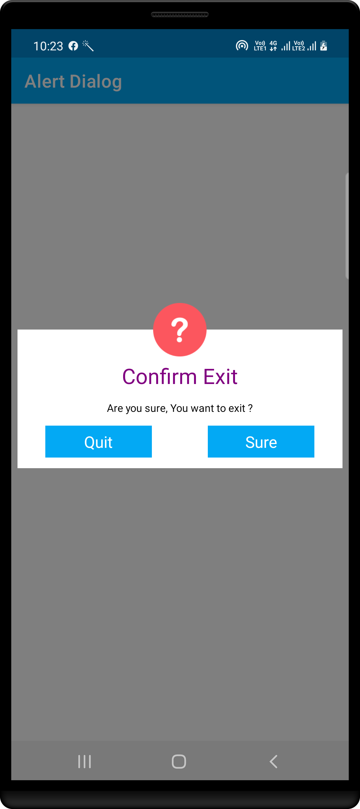
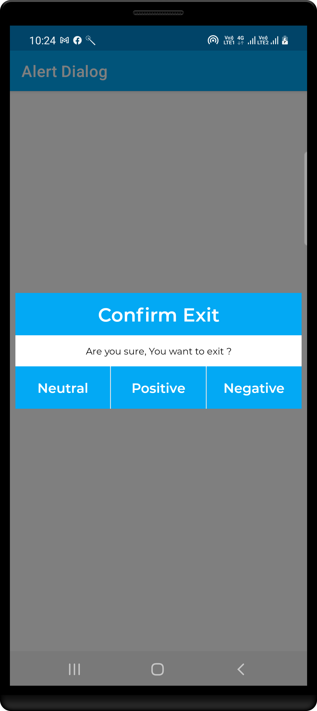
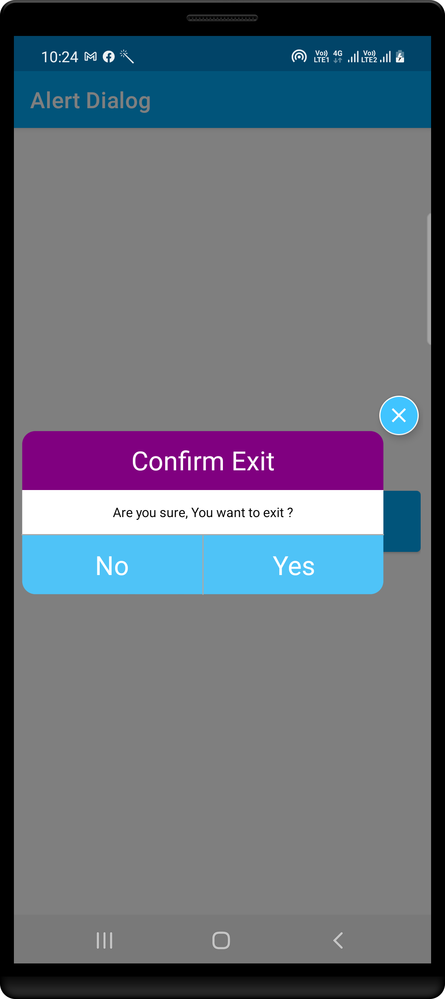
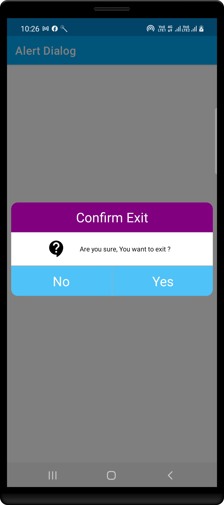
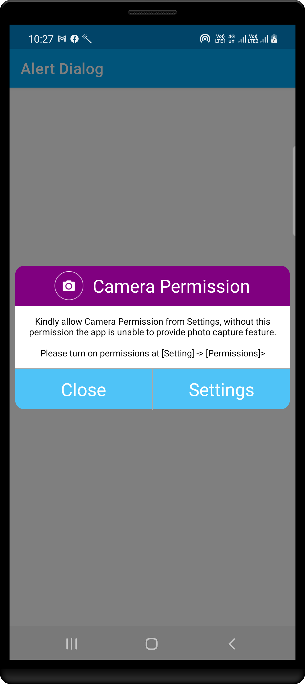

# JAVA - CustomDialogLayout #

|                  1                |                 2                 |                 3                 |                  4               |
|-----------------------------------|-----------------------------------|-----------------------------------|----------------------------------|
|  |  |  | |

|                  5                |                   6               |                 7                 |                   8              |
|-----------------------------------|-----------------------------------|-----------------------------------|----------------------------------|
|  |  |  | |

|                  9                |                  10               |                 11                |
|-----------------------------------|-----------------------------------|-----------------------------------|
|  | | |

## Author ##

Rohit Yadav

[rohitnotes24@gmail.com](mailto:rohitnotes24@gmail.com)

[http://badasoftware.com/](http://badasoftware.com/)
